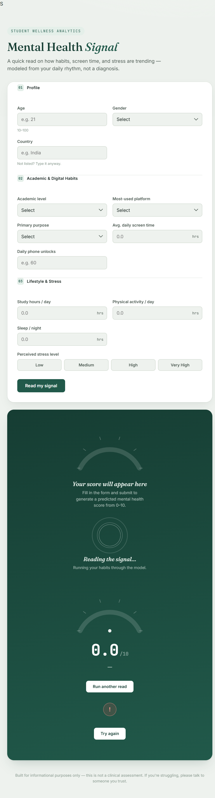

# Mental Health Signal

Student Wellness Analytics is a web application that estimates a student's mental health score from social media habits, study time, sleep, physical activity, and perceived stress.

> This project is for informational purposes only. It is not a clinical assessment or a medical diagnosis.

## UI Preview



## Features

- Responsive HTML, CSS, and JavaScript interface
- Client-side form validation
- FastAPI prediction backend
- Scikit-learn model loaded from `Mental_Health_Model.pkl`
- Interactive score result with a visual gauge
- Swagger API documentation through FastAPI

## Project Structure

```text
Mental-Health-Score/
|-- index.html                         Frontend page
|-- style.css                          Frontend styles
|-- script.js                          Form logic and API requests
|-- main.py                            FastAPI application
|-- Mental_Health_Model.pkl             Trained prediction model
|-- Student Social Media And Mental Health Impact.csv
|-- ML_Project.ipynb                   Model training notebook
|-- requirements.txt                   Python dependencies
`-- ui-screenshot.png                  README preview image
```

## Run Locally

From the `Mental-Health-Score` directory:

```powershell
py -m venv .venv
.\.venv\Scripts\Activate.ps1
pip install -r requirements.txt
python -m uvicorn main:app --reload
```

The API is available at `http://127.0.0.1:8000`. Open `http://127.0.0.1:8000/docs` to view the interactive API documentation.

Open `index.html` with VS Code Live Server to use the frontend. The frontend currently sends requests to the deployed API configured in `script.js`.

## API

### `POST /predict`

The endpoint accepts student profile, academic, social media, lifestyle, and stress data and returns a predicted score:

```json
{
	"predicted_mental_health_score": 6.78
}
```

## Deployment

Deploy `main.py` as a Render Web Service:

```text
Root Directory: Mental-Health-Score
Build Command: pip install -r requirements.txt
Start Command: uvicorn main:app --host 0.0.0.0 --port $PORT
```

Deploy the same directory as a Render Static Site with an empty build command and `.` as the publish directory. Update `API_BASE` in `script.js` to match the deployed backend URL.

## Technology

Python, FastAPI, Pydantic, Pandas, Joblib, Scikit-learn, HTML, CSS, and JavaScript.